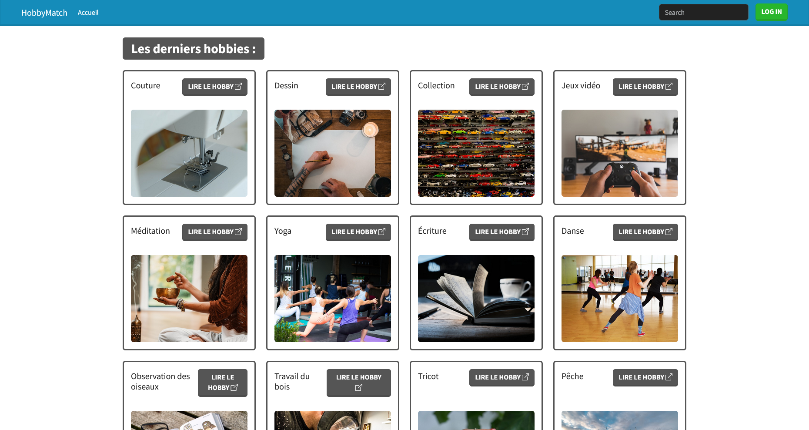

# HobbyMatch PHP MVC API

This is the backend API for **HobbyMatch**, a social platform that helps people find others with similar hobbies and interests. Built using a custom PHP MVC architecture, this project handles user authentication, hobby matching logic, and provides a set of RESTful endpoints consumed by the HobbyMatch Flutter frontend.

## 📱 Flutter Frontend

Check out the Flutter frontend for this API here:  
👉 [HobbyMatch Flutter App](https://github.com/taco-greco/HobbyMatch-Flutter)

## 🧱 Features

- ✅ Custom PHP MVC framework
- 🔐 JWT-based authentication
- 🧑‍🤝‍🧑 User registration and login
- 🧠 Intelligent hobby matching algorithm
- 📄 RESTful API with clean routing
- 🛡️ Input validation and error handling

## 📂 Project Structure

```
└── 📁public
    └── 📁assets
        └── 📁css
            └── style.css
        └── 📁js
            └── script.js
    └── 📁uploads
        └── 📁images
            └── 📁fixtures
        └── 📁pdf
    └── .htaccess
    └── index.php
└── 📁src
    └── 📁Controller
    └── 📁Model
    └── 📁Service
    └── 📁View
        └── 📁Admin
            └── 📁Hobby
        └── base.html.twig
        └── error.html.twig
        └── 📁Hobby
        └── 📁Mailing
        └── 📁User
```

## 📸 Screenshots

### 🏠 Index Page (Landing)



## 🚀 Getting Started

### Prerequisites

- PHP 8.x+
- MySQL
- Composer

### Installation

1. Clone the repo
   ```bash
   git clone https://github.com/taco-greco/HobbyMatch-PHP-MVC-API.git
   cd HobbyMatch-PHP-MVC-API
   ```

2. Install dependencies
   ```bash
   composer install
   ```

3. Set up environment variables  
   Copy `.env.example` to `.env` and update the database credentials.

4. Import the database  
   Import `hobbies.sql` into your MySQL server.

5. Run the server
   ```bash
   php -S localhost:8000 -t public
   ```

Now you can access the API at `http://localhost:8000`.

## 🛠️ API Endpoints

### Token/login

* **POST** `/User/loginjwt`

### ApiHobby

* **POST** `/ApiHobby/add` (Requires Token)
* **PUT** `/ApiHobby/update/{id}` (Requires Token, e.g., `/ApiHobby/update/200`)
* **DELETE** `/ApiHobby/delete/{id}` (Requires Token, e.g., `/ApiHobby/delete/199`)
* **GET** `/ApiHobby/getAll`
* **GET** `/ApiHobby/getAll/page`


## 🧑‍💻 Author

- GitHub: [taco-greco](https://github.com/taco-greco)

## 📄 License

MIT License – feel free to use, modify, and contribute!
